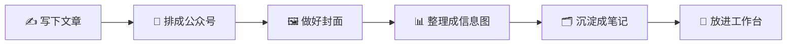

  

  # 秋秋很开心

  ### 把日常里真正好用的东西，做成下次还能继续用的小工具

  内容创作 · AI 工具 · 个人知识库

> 你好，我是秋秋。这里不是程序员作品集，而是一个普通内容创作者的“省事工具箱”。
>
> 写完一篇文章、做一张封面、整理一堆资料、搭一个工作台……能少从零来一次，就少折腾一次。

## 先从这里逛

| 你现在想解决什么？ | 先打开这个 |
| --- | --- |
| 一篇 Markdown，怎么排成公众号好看的样子？ | [秋秋公众号编辑器 →](https://github.com/qqhkx2027/qiuqiu-wechat-editor) |
| 不会设计，怎么写出靠谱的封面提示词？ | [秋秋封面提示词 →](https://github.com/qqhkx2027/qiuqiu-cover-prompt) |
| 一堆文章和资料，怎么慢慢沉淀下来？ | [秋秋 Obsidian 笔记助手 →](https://github.com/qqhkx2027/qiuqiu-obsidian-notes) |

## 一篇内容，怎么变成能反复用的东西？

这就是我做这些项目的原因：把一次性的麻烦，慢慢变成以后能复用的方法。

## 秋秋的小工具箱

<table>
  <tr>
    <td width="50%" valign="top">
      <h3>📰 公众号编辑器</h3>
      
把 Markdown 文章排成适合公众号发布的样子。

      <a href="https://github.com/qqhkx2027/qiuqiu-wechat-editor">打开项目 →</a>
    </td>
    <td width="50%" valign="top">
      <h3>🖼️ 封面提示词</h3>
      
把文章和参考图整理成更具体、更好用的封面提示词。

      <a href="https://github.com/qqhkx2027/qiuqiu-cover-prompt">打开项目 →</a>
    </td>
  </tr>
  <tr>
    <td width="50%" valign="top">
      <h3>📊 信息图制作器</h3>
      
把复杂内容梳理成更清楚的信息图方案。

      <a href="https://github.com/qqhkx2027/qiuqiu-infographic-maker">打开项目 →</a>
    </td>
    <td width="50%" valign="top">
      <h3>📚 Obsidian 笔记助手</h3>
      
从第一次打开 Obsidian 开始，慢慢搭好自己的笔记系统。

      <a href="https://github.com/qqhkx2027/qiuqiu-obsidian-notes">打开项目 →</a>
    </td>
  </tr>
  <tr>
    <td width="50%" valign="top">
      <h3>🧩 工作台搭建器</h3>
      
把内容排期、日常记录或习惯打卡，搭成自己的小工作台。

      <a href="https://github.com/qqhkx2027/qiuqiu-workbench-builder">打开项目 →</a>
    </td>
    <td width="50%" valign="top">
      <h3>🪪 证件工坊</h3>
      
在浏览器里裁剪证件照，并排成可打印的 A4 PDF。

      <a href="https://github.com/qqhkx2027/qiuqiu-document-workshop">打开项目 →</a>
    </td>
  </tr>
</table>

## 第一次来，推荐这样用

1. 从一篇已经写好的文章开始，试试 [公众号编辑器](https://github.com/qqhkx2027/qiuqiu-wechat-editor)。
2. 再用 [封面提示词](https://github.com/qqhkx2027/qiuqiu-cover-prompt)，给同一篇文章准备公众号、小红书、抖音三种封面方向。
3. 最后把这次好用的提示词和方法，放进 [Obsidian 笔记助手](https://github.com/qqhkx2027/qiuqiu-obsidian-notes)。

不用一次把六个都学会。先让一个工具真的替你省下半小时，就够了。

## 我相信的事

> 不用先成为程序员，才配拥有自己的工具。

技术最有用的时候，不是让人看起来多厉害，而是把重复、混乱和“下次又要从头来”的麻烦，悄悄拿走一点。

---

这些项目分别使用 MIT License；具体以各仓库根目录的 LICENSE 为准。
